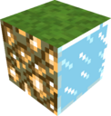

#  LampCraft 

Does that looks familiar?

Does that looks familiar?

_Does that looks familiar?_

Does that looks familiar?

---

## v1.x.x

Данная игра была сделана в виде **домашнего задания** по изучению **OpenGL**. Тем не менее автору очень понравился
концепт и вместо просто чего-то "прикольного" он решил сделать игру... "ламповой" 💡

_Прям как во сне_

> Честно говоря, мне довольно чужды самые ранние версии игры — я их банально не застал. И полагаю я что не один такой.
> Текстурки были взяты из pre-1.16 📦
>
> Есть в этом своя _романтика_. Не так ли?..

## О чем игра?

Идея в том, чтобы сделать нечто, что отобразилось у меня в памяти с детства: что-то очень... "классическое", "
ванильное", "беззаботное"...
Что-то воистину **л а м п о в о е**

...

Но на данный момент — просто бродилка в мире 124x124x124, где можно ставить и ломать 10 различных блоков

## Планы (или почему так скудно)

Сами OpenGL и GLFW заметно отличны от любого другого инструмента, что довелось мне испльзовать на веку моем. Они, прежде
всего, еще из C...

> Это и есть главная причина — больно уж сложно их поддерживать. Черезчур они низкоуровневые. Это как писать на
> ассемблере инжерерный калькулятор в терминале 💀

Тем не менее было достаточно интересно применять все возможные способы схитрить, продумывать работу вещей типа RayCast и
в целом заниматься подобного рода садомазохизмам. Поэтому, если по дивным мне причинам у меня останется желание, или
даже я увижу смысл продолжать работу над проектом, то я бы хотел:

- Оптимизация и поддержка:
    - [ ] Зарефакторить код
    - [ ] (?) Перейти на более современный движок? (на самом деле я очень не хочу этого делать)
- Работа с мирами:
- [ ] Добавить возможность сохранять/загружать миры
- [ ] Сделать генерацию различных интересных миров через работу с шумом
- [ ] Вещи типа дверей, цветочков и всего такого
- Игра
    - [ ] Коммандную строку
    - [ ] Больше мистификации,✨ вайбы херобрина ✨
    - [ ] Настройки
    - [ ] Изучить сокеты и внедрить с ними некое подобие мультиплеера

---

|  | Надеюсь вам понравилось! Во вкладке Release есть сборки для Windows и Linux (Appimage) |
|:----------------------------:|:--------------------------------------------------------------------------------------:|

